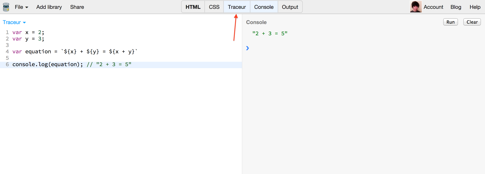
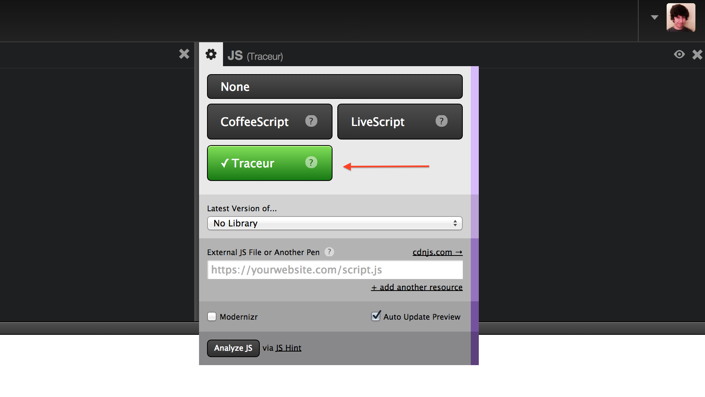
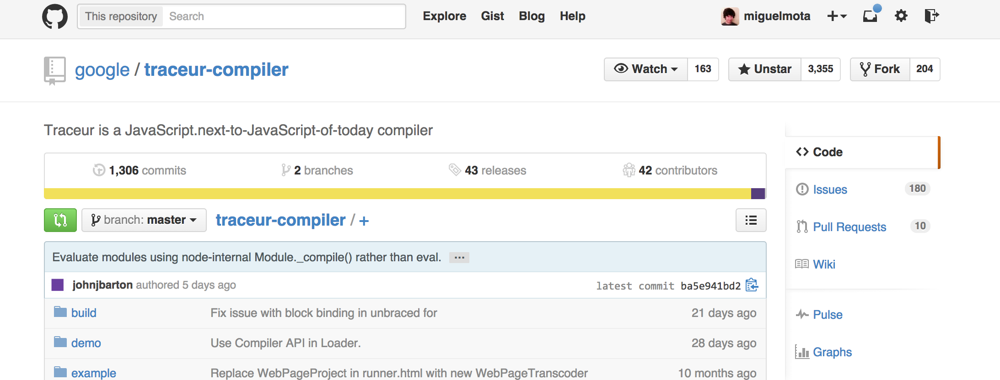
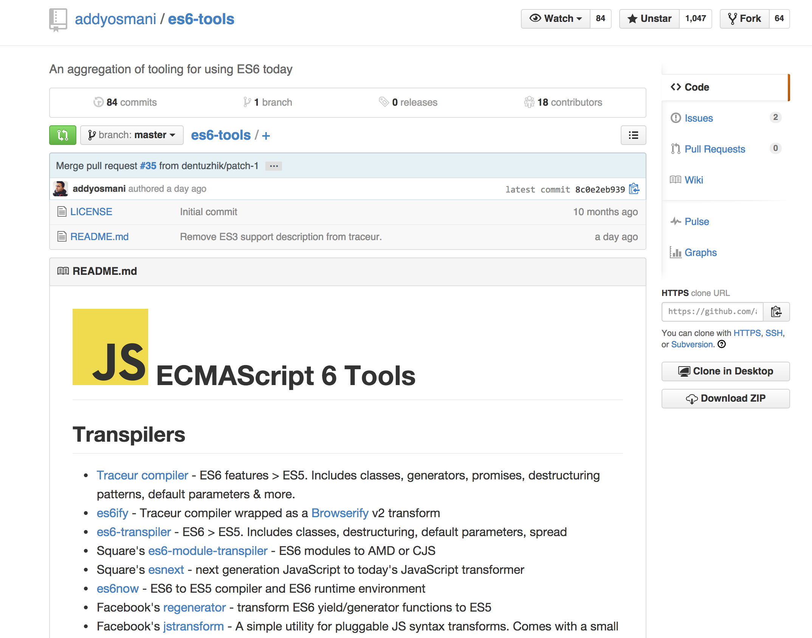
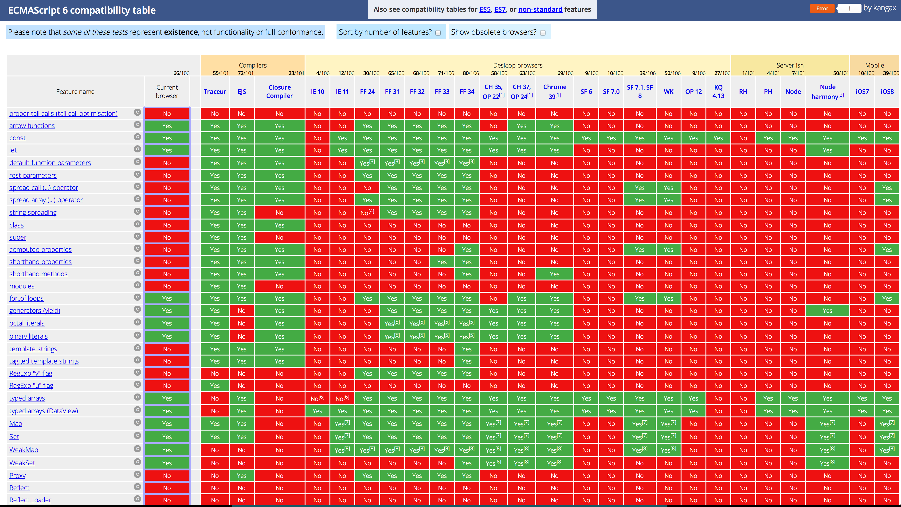
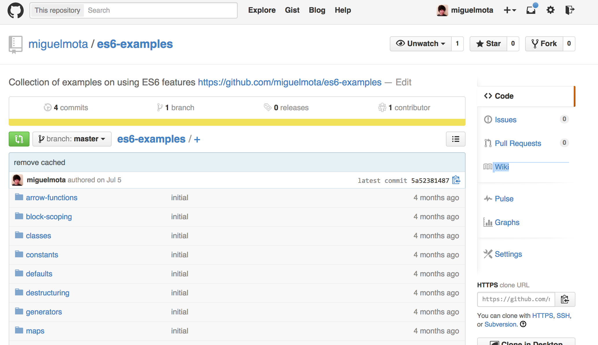

title: ES6 Examples
output: es6.html
controls: true
theme: ./cleaver-classic-theme

--
# ES6
## The sexy parts

--
### Arrow Functions

Not Sexy

```javascript
var sumSquares = [1,2,3].map(function(x) {
                          return x * x;
                        }).reduce(function(a, b) {
                          return a + b;
                        });

console.log(sumSquares); // 14
```

Sexy

```javascript
let sumSquares = [1,2,3].map((x)=> x*x)
                        .reduce((a, b)=> a + b); // no explicit return

console.log(sumSquares); // 14
```

--
### Arrow Functions

Not Sexy

```javascript
function F(t) {
  setTimeout(function() {
      log(this.t);
  }.bind(this));
}

F.call({t:100});
```

Sexy

```javascript
function F(t) {
  setTimeout(()=> {
      log(this.t);
  });
}

F.call({t:100});
```

--
### Spread Operators


```javascript
Math.max(3,5,2); // 5
```

What about an array? Not sexy.

```javascript
Math.max.apply(null, [3,5,2]); // 5
```

Sexy

```javascript
Math.max(...[3,5,2]); // 5
```

--

### Rest Parameters

Not Sexy

```javascript
function fn(first/*, rest */) {
  var rest = [].slice.call(arguments, 1);

  console.log(first); // "a"
  console.log(rest); // [1, 2, 3]
}

fn('a', 1, 2, 3);
```

Sexy

```javascript
function fn(first, ...rest) {
  console.log(first); // "a"
  console.log(rest); // [1, 2, 3]
}

fn('a', 1, 2, 3);
```

--
### Destructuring

Not Sexy

```javascript
var array = ['foo','bar','qux'];

var a = array[1];
var b = array[2];

console.log(a); // "bar"
console.log(b); // "qux"
```

Sexy

```javascript
let [,a,b] = ['foo','bar','qux'];

console.log(a); // "bar"
console.log(b); // "qux"
```

```javascript
let {parse, stringify} = JSON;

parse('{"a":"b"}') // {a: "b"}
stringify({a:'b'}) // "{\"a\":\"b\"}"
```

--
### Generators

Sexy

```javascript
function* count(start) {
    let i = start || 0;
    while(true) {
        yield i++;
    }
}

function* take(iterable, numToTake) {
    var i = 0;
    for (var taken of iterable) {
        if (i++ === numToTake) {
            return;
        }
        yield taken;
    }
}

for (var i of take(count(10), 5)) {
    console.log(i); // 10, 11, 12, 13, 14
}
```

--


### Template Strings

Not Sexy

```javascript
var x = 2, y = 3;

var equation = x + ' + ' + y + ' = ' + (x + y);
console.log(equation); // "2 + 3 = 5"
```

Sexy

```javascript
let x = 2, y = 3;

let equation = `${x} + ${y} = ${x + y}`
console.log(equation); // "2 + 3 = 5"
```

```javascript
let dob = '09/21/1991', seperator = '/';

let parts = dob.match(new RegExp(`[^${seperator}]\+`, 'gi'));

console.log(parts); // ["09", "21", "1991"]
```

--
### Proxies

```javascript
var nums = [1,2,3];

// Not Sexy
console.log(nums[nums.length - 1]); // 3
```

```javascript
// Proxy sexiness juice
function smartArray(arr) {
  return Proxy(arr,
          {get: function(p,x) {
            if (Number(x) < 0) {
              return p[p.length + Number(x)];
            }
            return p[x];
          }}
  );
}

let nums = smartArray([1,2,3]);

console.log(nums[0]); // 1
// Sexy
console.log(nums[-1]); // 3
```

--
### Proxies

Not Sexy

```javascript
var salesContact;

if (company && company.employees && company.employees.sales && company.employees.sales.contact) {
  salesContact = company.employees.sales.contact;
}
```

Sexy

```javascript
var Obj = Function();
var nullProxy = Proxy(
    {toString: ()=> 'nullProxy'},
    {get: (t,p) => t[p] || new Obj() }
);
Obj.prototype = nullProxy;

var company = Object.create(nullProxy /*, data */);
// Sexy
var salesContact = company.employees.sales.contact;
console.log(company); // 'nullproxy'
```

--
### ES6 features

* Arrow Function
* Spread Operator
* Rest Parameters
* Generators
* Destructuring
* Template Strings
* Proxies
* Symbols
* Weak Maps
* Sets
* Promises
* Defaults
* Block Scoping
* Constants
* Classes
* Modules
* ...and a lot more

--
### ES7

Popular features

* Object.observe
* Typed objects
* Array comprehensions `[ x for (x of a) if (x.color === ‘blue’) ]`
* Exponentiation operator `2^8`
* Async functions?

--
### JSBin

[http://jsbin.com/](http://jsbin.com/)



--
### Codepen

[http://codepen.io/](http://codepen.io/)



--
### ES6 in Node

```bash
$ node --harmony
```

* Generators (--harmony_generators)
* Collections (--harmony_collections sets, maps, and weak maps)
* Proxies (--harmony_proxies)
* Modules (--harmony_modules)
* Scoping (--harmony_scoping)
* Observation (--harmony_observation)
* Symbols (--harmony_symbols)

```bash
node --v8-options
```

--
### Traceur Compiler (ES6 -> ES5)

[https://github.com/google/traceur-compiler](https://github.com/google/traceur-compiler)



--
### More ES6 Tools

[https://github.com/addyosmani/es6-tools](https://github.com/addyosmani/es6-tools)



--
### Compatibility Table

[http://kangax.github.io/compat-table/es6/](http://kangax.github.io/compat-table/es6/)



--
### ES6 Examples

[https://github.com/lukehoban/es6features](https://github.com/lukehoban/es6features)

[https://github.com/JustinDrake/node-es6-examples](https://github.com/JustinDrake/node-es6-examples)

[https://github.com/miguelmota/es6-examples/](https://github.com/miguelmota/es6-examples/)



--
### ESDiscuss

[https://esdiscuss.org/](https://esdiscuss.org/)

--
### That's all folks.

Find me in the internetz

* [https://miguelmota.com](https://miguelmota.com/)
* [https://github.com/miguelmota](https://github.com/miguelmota)
* [https://twitter.com/_moogs](https://twitter.com/_moogs)

